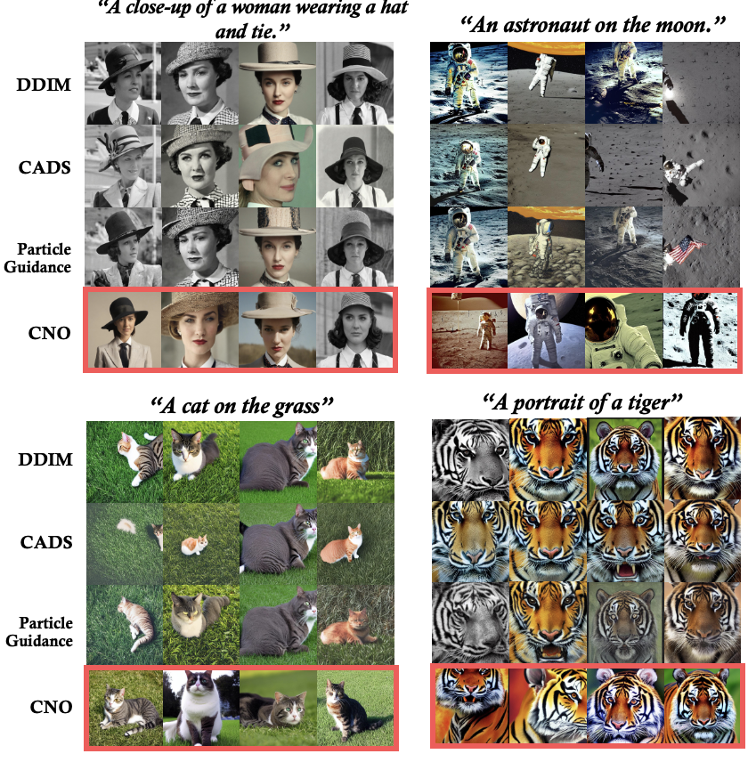
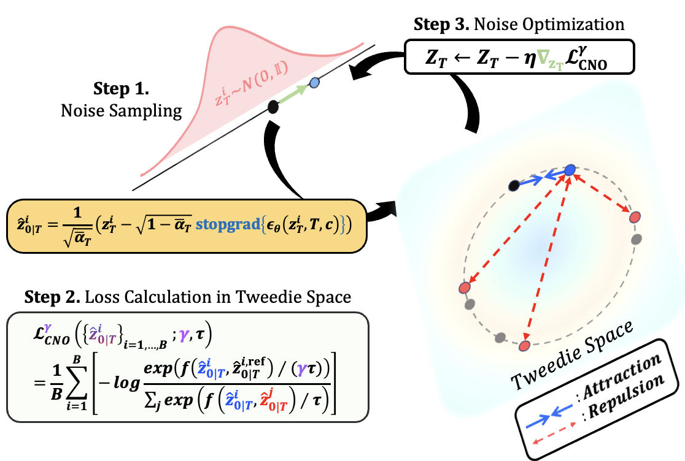

# Diverse Text-to-Image Generation via Contrastive Noise Optimization (ICLR 2026)

[](https://arxiv.org/abs/2510.03813)
[](https://opensource.org/licenses/MIT)

Official PyTorch implementation of **"DIVERSE TEXT-TO-IMAGE GENERATION VIA CONTRASTIVE NOISE OPTIMIZATION"**.  
By Byungjun Kim, Soobin Um, and Jong Chul Ye.  
Published as a conference paper at **ICLR 2026**.

---

<p align="center">
  
  <br>
  <em><b>Figure 1:</b> Comparison of diversity. Standard DDIM exhibits pronounced mode collapse (repetitive images), while our <b>CNO</b> delivers markedly greater diversity and fidelity, generating a wide range of images that remain strongly aligned with the input text.</em>
</p>

## 📖 Abstract
Text-to-image (T2I) diffusion models have demonstrated impressive performance in generating high-fidelity images, largely enabled by text-guided inference. However, this advantage often comes with a critical drawback: **limited diversity**, as outputs tend to collapse into similar modes under strong text guidance.

In this work, we introduce **Contrastive Noise Optimization (CNO)**, a simple yet effective method that addresses the diversity issue from a distinct perspective. Unlike prior techniques that adapt intermediate latents, our approach shapes the initial noise to promote diverse outputs. Specifically, we develop a contrastive loss defined in the Tweedie data space and optimize a batch of noise latents.

---

## 🛠️ Method
<p align="center">
  
  <br>
  <em><b>Figure 2: Overview of CNO.</b> We optimize the initial noise latent space using a contrastive loss in the Tweedie-denoised space to ensure both diversity and text-alignment.</em>
</p>

---


## 🚀 Getting Started

### Prerequisites
```bash
# Clone the repository
git clone [https://github.com/Jecstar66/CNO.git](https://github.com/Jecstar66/CNO.git)
cd CNO

# Create a conda environment
conda env create -f environments.yml
conda activate cno

# Install dependencies
pip install -r requirements.txt
